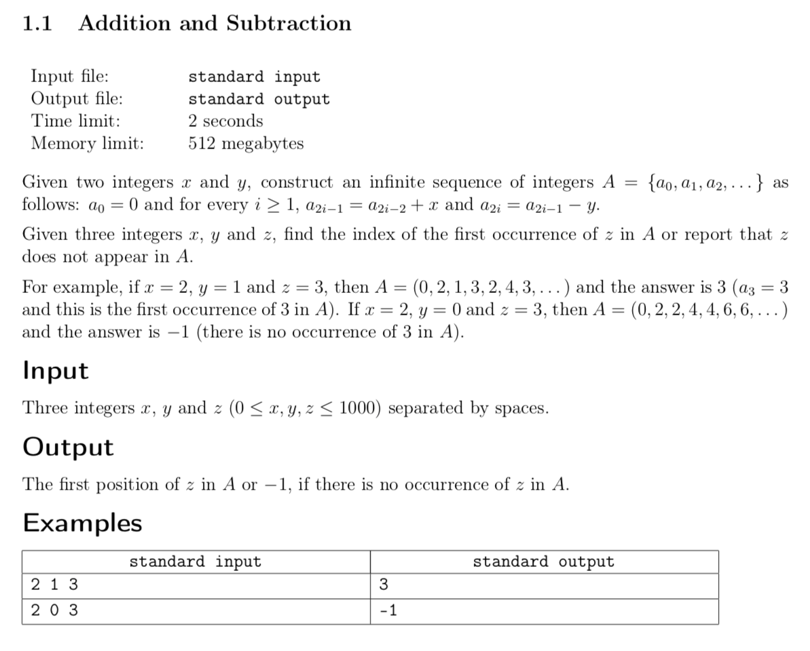

# Week 1: Programming Competitions
## Resources
* [Competitions](competitions.pdf)
* [Testing](testing.pdf)

## Assignments

* [Inventing Tests](#inventing-tests)
* [Addition and Subtraction](#addition-and-subtraction)

---

### Inventing Tests

* **Problem 1:** You are given a non-empty list of integers, and you need to find the maximum value among them. The length of the list is not greater than 100, and the absolute value of each element is not greater than 1000.

```python
def solve(a):
  max = 0
  for x in a:
    if x > max:
      max = x
  return max
```

* **Test 1:** Implement a function called getTest. It should return a list on which the solve function works incorrectly.

```python
def getTest():
  return [-1, -2, -3]
```	

* **Problem 2:** You are given a non-empty list of integers. Find the maximum possible value which could be obtained as the sum of no more than two elements from the list. You can't take the same element twice, but you could take two distinct elements which are equal by value. The length of the list is not greater than 100, each element is positive and not greater than 1000.

```python
def solve(a):
  max = 0
  for i in range(len(a)):
    for j in range(len(a)):
      if i != j and a[i] + a[j] > max:
        max = a[i] + a[j]
  return max
```

* **Test 2:** Implement a function called getTest. It should return a list on which the solve function works incorrectly.

```python
def getTest():
  return [-1]
```

* **Problem 3:** Given an integer N, find how many pairs of distinct integers from 0 to N - 1 sum up to an even value. (1, 2) and (2, 1) are the same pair. N is positive, and doesn't exceed 100000.

```python
def solve(n):
  ans = 0
  for i in range(n):
    for j in range(n):
      if i < j and (i + j) % 2 == 0:
        ans += 1
  return ans
```

* **Test 3:** Implement a function called getTest. It should return a list on which the solve function works incorrectly.

```python
def getTest():
  return 100000
```

* **Problem 4:** You are given a string of lowercase English letters. First, remove all occurrences of its first letter, e.g. "abacaba" -> "bcb". Then, return the longest prefix of the remaining string which doesn't contain two different letters. The initial string is at least 5 and no more than 100000 characters long.

```python
def solve(s):
  toDelete = s[0]
  others = ""
  for c in s:
    if c != toDelete:
      others += c
  s = others
  
  #prefix of length 1 surely doesn't contain different letters
  prefix = s[0]
  for i in range(1, len(s)):
    #each letter should be the same as the first
    if s[i] == prefix[0]:
      prefix += s[i]
    else:
      break
  return prefix
```

* **Test 4:** Implement a function called getTest. It should return a list on which the solve function works incorrectly.

```python
def getTest():
  return "aaaaa"
```

---

### Addition and Subtraction



```cpp
#include <iostream>

using namespace std;

int N = 2 * 1000; // 2 ops (add/sub) result in minimum "helpful" delta of 1 (ie. go 1 step closer to max target 1000)
int main() {
    auto add{ 0 }, sub{ 0 }, target{ 0 }, ans{ -1 };
    cin >> add >> sub >> target;
    for (auto i{ 0 }, x{ 0 }; i <= N; ++i) {
        if (x == target) {
            ans = i;
            break;
        }
        x += i % 2 == 0 ? add : -sub;
    }
    cout << ans << endl;
    return 0;
}
```
