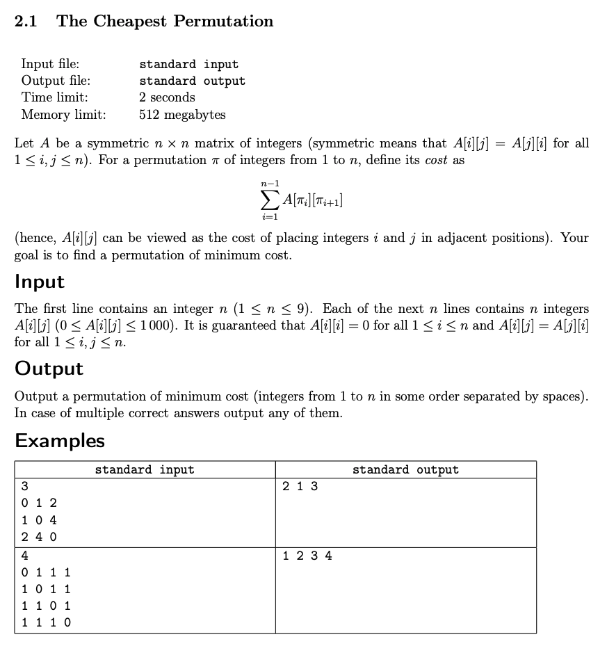
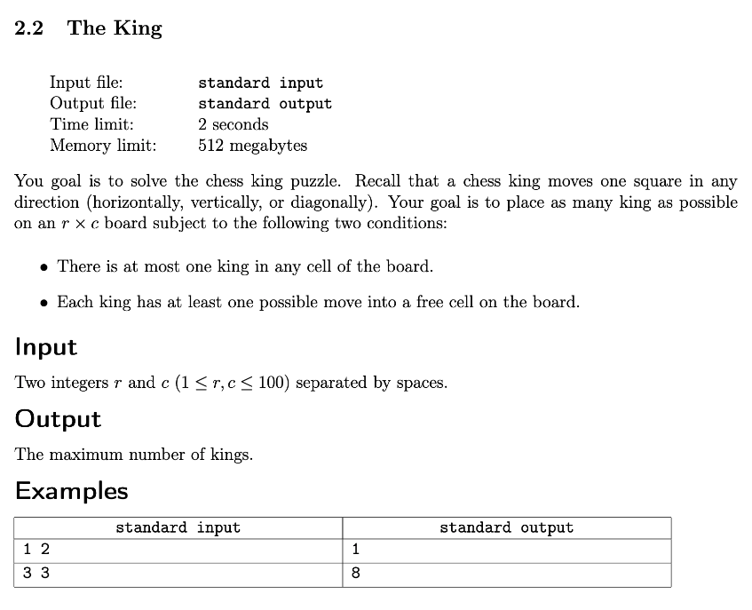
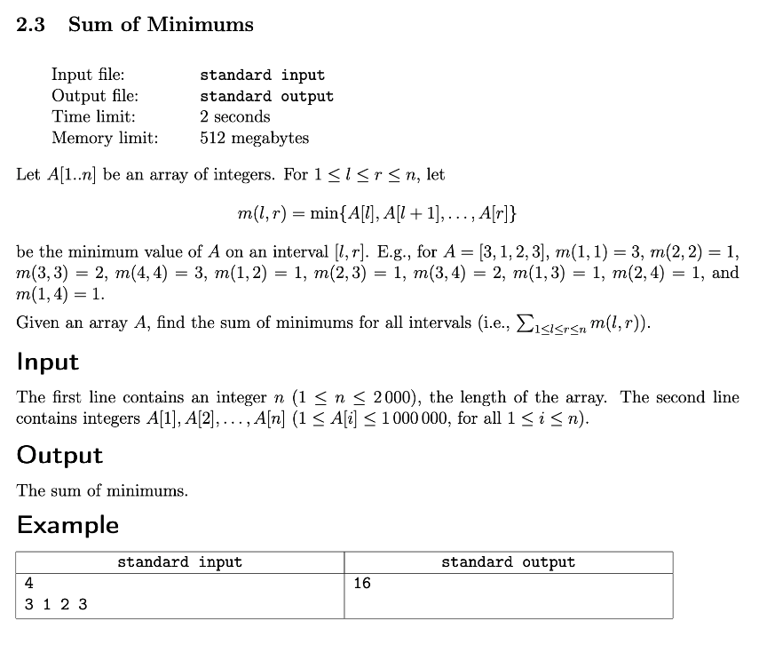
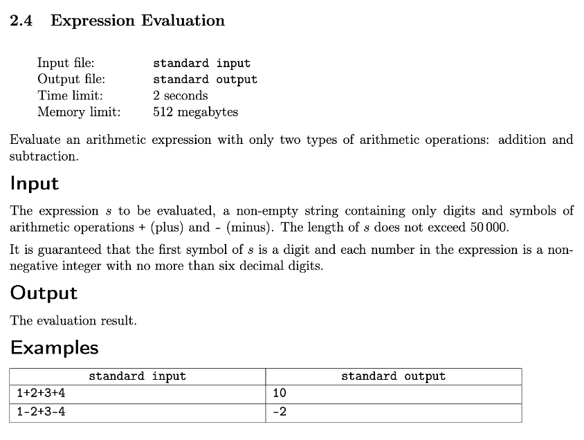

# Week 2: Correctness First
## Key Concepts
* Deduce simple upper bounds on a solution's running time and decide if it's fast enough for a given time limit
* Implement brute force solutions with basic recursive backtracking
* Understand the connection between code structure and the logic behind it

## Resources
1. **[Structuring Code](2_correctness_first/docs/1_structuring_code/structuring_code.pdf)**
2. **Brute-Force Solutions:** Always Conceptually Correct (but extremely slow)
	* [Intuitive "Proofs" are Wrong](2_correctness_first/docs/2_brute_force_solutions/proofs.pdf)
	* [Defining Solution Set](2_correctness_first/docs/2_brute_force_solutions/solutionset.pdf)
		* Search Space (ie. set A)
			* Find an element of a set A which satisfies some property
			* Find an element of a set A which minimizes/maximizes an objective function
			* Find the number of elements of a set A satisfying some property
	* [Recursive Backtracking](2_correctness_first/docs/2_brute_force_solutions/backtracking.pdf): Code equivalent to N nested for-loops
		* Recipe for developing a brute-force solution:
			* Identify the search space for a problem
			* Design a method to enumerate all elements of the search space
3. **Time Complexity:** Estimating the number of unit operations in an algorithm
	* [Worst Cases](2_correctness_first/docs/3_time_complexity/worst_average.pdf)
	* [Big-O Notation](2_correctness_first/docs/3_time_complexity/bigO.pdf)
		* Always calculate the Big-O asymptotic bound before implementation
	* [From Theory to Practice: How to make a solution faster](2_correctness_first/docs/3_time_complexity/time_final.pdf)
		* Focus optimizations on bottlenecks only
		* First optimize asymptotically (major gain), if and only if this fails, then further optimize constants (minor gain)

## Assignments
0. [Quiz](#quiz)
1. [The Cheapest Permutation](#the-cheapest-permutation)
2. [The King](#the-king)
3. [Sum of Minimums](#sum-of-minimums)
4. [Expression Evaluation](#expression-evaluation)

---

## Quiz
Below you see a function, which calculates a certain value from an array.

```python
def calculate(a):
  result = 0
  
  for x in a:
    sum = 0
    for y in a:
      sum += y
    result += sum * x
    
  return result
```

Could you make it faster so it still returns the same value?  Assume that the array has no more than 100,000 elements.


```python
import functools

def calculate(a):
	result = 0
	sum = functools.reduce(lambda total, cur: total + cur, a)
	for x in a:
		result += sum * x
	return result
```

---

## The Cheapest Permutation



```cpp
#include <iostream>
#include <vector>
#include <algorithm>
#include <numeric>
#include <iterator>

using namespace std;
using VI = vector<int>;
using VVI = vector<VI>;

int main() {
    int N; cin >> N;
    VVI A(N, VI(N));
    for (auto i{ 0 }; i < N; ++i)
        for (auto j{ 0 }; j < N; ++j)
            cin >> A[i][j];
    auto INF = 1e9 + 7, best = INF;
    VI cur(N), ans;
    iota(cur.begin(), cur.end(), 0);
    auto calcCost = [&](int i = 0, int j = 0, int cost = 0) {
        for (auto k{ 0 }; k + 1 < N; ++k)
            i = cur[k],
            j = cur[k + 1],
            cost += A[i][j];
        return cost;
    };
    do {
        auto cost = calcCost();
        if (best > cost)
            best = cost,
            ans = cur;
    } while (next_permutation(cur.begin(), cur.end()));
    transform(ans.begin(), ans.end(), ans.begin(), [](auto x) { return x + 1; }); // 0-based to 1-based indexing
    copy(ans.begin(), ans.end(), ostream_iterator<int>(cout, " ")), cout << endl;
    return 0;
}
```

---

## The King



```cpp
#include <iostream>
#include <vector>
#include <numeric>

using namespace std;
using VI = vector<int>;
using VVI = vector<VI>;

int main() {
    int M, N; cin >> M >> N;
    VVI A(M, VI(N));
    // clock-wise: up, up-right, right, down-right, down, down-left, left, up-left
    VVI dirs = { {-1, 0}, {-1, 1}, {0, 1}, {1, 1}, {1, 0}, {1, -1}, {0, -1}, {-1, -1} };
    auto inBounds = [&](auto i, auto j) {
        return 0 <= i && i < M && 0 <= j && j < N;
    };
    auto adjSpaces = [&](auto i, auto j) {
        auto spaces{ 0 };
        for (auto& dir: dirs) {
            auto u = i + dir[0],
                 v = j + dir[1];
            if (inBounds(u, v) && A[u][v] == 0)
                ++spaces;
        }
        return spaces;
    };
    auto ok = [&](auto i, auto j) {
        if (adjSpaces(i, j) == 0)
            return false; // no empty space for a king at i,j ❌
        for (auto& dir: dirs) {
            auto u = i + dir[0],
                 v = j + dir[1];
            if (inBounds(u, v) && A[u][v] == 1 && adjSpaces(u, v) == 1)
                return false; // adj u,v king's only empty space is i,j so we cannot place a king here ❌
        }
        return true;
    };
    for (auto i{ 0 }; i < M; ++i)
        for (auto j{ 0 }; j < N; ++j)
            if (ok(i, j))
                A[i][j] = 1;
    auto kings{ 0 };
    for (auto& row: A)
        kings += accumulate(row.begin(), row.end(), 0);
    cout << kings << endl;
    return 0;
}
```

---

## Sum of Minimums



```cpp
#include <iostream>
#include <vector>
#include <algorithm>
#include <iterator>

using namespace std;

int main() {
    int N; cin >> N;
    vector<int> A; copy_n(istream_iterator<int>(cin), N, back_inserter(A));
    auto sum{ 0L };
    for (auto i{ 0 }; i < N; ++i)
        for (auto j{ i + 1 }; j <= N; ++j)
            sum += *min_element(A.begin() + i, A.begin() + j); // min[i..j)
    cout << sum << endl;
    return 0;
}
```

---

## Expression Evaluation



```cpp
#include <iostream>
#include <sstream>
#include <vector>
#include <algorithm>
#include <iterator>
#include <numeric>

using namespace std;

int main() {
    string s; cin >> s;
    auto getNums = [&](string t = {}, vector<int> nums = {}) {
        transform(s.begin(), s.end(), back_inserter(t), [](auto c) {
            return isdigit(c) ? c : ' ';
        });
        istringstream stream{ t };
        copy(istream_iterator<int>(stream), istream_iterator<int>(), back_inserter(nums));
        return nums;
    };
    auto getOps = [&](string t = {}, vector<char> ops = {}) {
        transform(s.begin(), s.end(), back_inserter(t), [](auto c) {
            return !isdigit(c) ? c : ' ';
        });
        istringstream stream{ t };
        copy(istream_iterator<char>(stream), istream_iterator<char>(), back_inserter(ops));
        return ops;
    };
    auto nums = getNums();
    auto ops = getOps();
    for (auto i{ 1 }; i < nums.size(); ++i)
        if (ops[i - 1] == '-')
            nums[i] = -nums[i];
    cout << accumulate(nums.begin(), nums.end(), 0L) << endl;
    return 0;
}
```