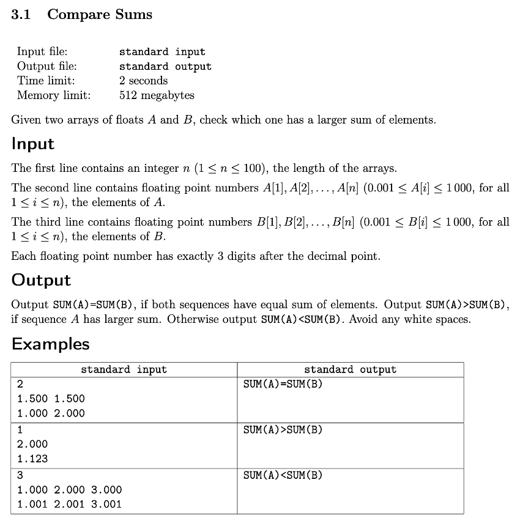
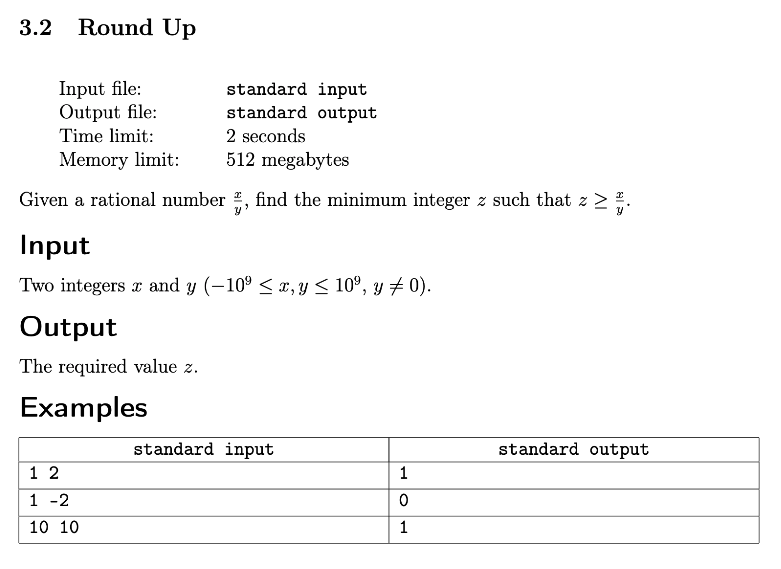
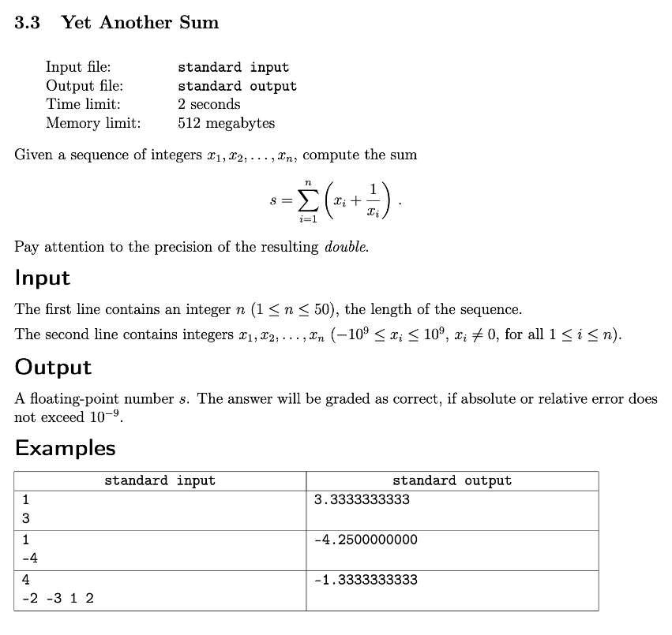
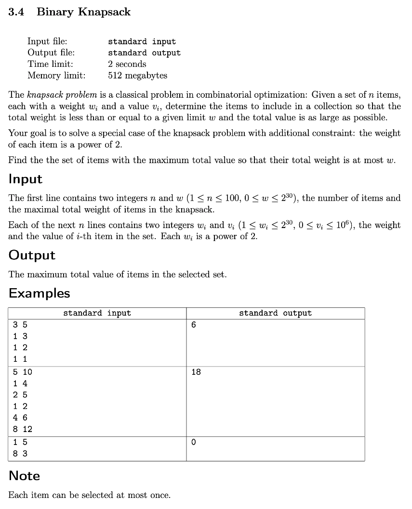

# Week 3: Common Struggles
## Key Concepts
* Know how integers are represented
* Identify places where integer overflow happens
* Know and compare different ways of representing non-integers, including floating point arithmetic
* Handle precision issues when performing basic operations with doubles
* Distinguish common situations when solution could be simplified by replacing doubles with integers
* Apply code structuring to simplify debugging
* Auto-check program correctness by identifying invariants and inserting corresponding assertions
* Understand motivation and strategy for upsolving

## Resources
1. [Insidious Numbers](docs/1_insidious_numbers/numbers.pdf)
2. [Getting Unstuck](docs/4_getting_unstuck/Getting_Unstuck.pptx)
3. [Binary Knapsack Solution](4_binary_knapsack/4_binary_knapsack.pdf)

## Assignments
0. [Quiz](docs/quiz.pdf)
1. [Compare Sums](#compare-sums)
2. [Round Up](#round-up)
3. [Yet Another Sum](#yet-another-sum)
4. [Binary Knapsack](#binary-knapsack)

---

## Compare Sums



```cpp
#include <iostream>
#include <vector>
#include <numeric>
#include <algorithm>
#include <iterator>

using namespace std;
using VI = vector<int>;

int main() {
    int N; cin >> N;
    auto getNums = [=](VI nums = {}) {
        for (auto K{ N }; K--;) {
            string s; cin >> s;
            s.erase(remove(s.begin(), s.end(), '.'), s.end());
            nums.push_back(stoi(s));
        }
        return nums;
    };
    VI A = getNums(),
       B = getNums();
    auto sumA = accumulate(A.begin(), A.end(), 0),
         sumB = accumulate(B.begin(), B.end(), 0);
    cout << "SUM(A)"
         << (sumA < sumB ? "<" : sumA > sumB ? ">" : "=")
         << "SUM(B)"
         << endl;
    return 0;
}
```

---

## Round Up



```cpp
#include <iostream>
#include <cmath>

using namespace std;

int main() {
    int x, y; cin >> x >> y;
    auto roundUp = [](double x, double y) { return static_cast<int>(ceil(x / y)); };
    cout << roundUp(x, y) << endl;
    return 0;
}
```

---

## Yet Another Sum



```cpp
#include <iostream>
#include <iomanip>
#include <vector>
#include <algorithm>
#include <iterator>
#include <numeric>

using namespace std;
using VD = vector<double>;

int main() {
    int N; cin >> N;
    VD A; copy_n(istream_iterator<double>(cin), N, back_inserter(A));
    auto intSum = [&]() {
        return accumulate(A.begin(), A.end(), 0.0);
    };
    auto divSum = [&](VD div = {}) {
        transform(A.begin(), A.end(), back_inserter(div), [](auto x) { return 1 / x; });
        return accumulate(div.begin(), div.end(), 0.0);
    };
    cout << setprecision(11) << intSum() + divSum() << endl;
    return 0;
}
```

---

## Binary Knapsack



```cpp
#include <iostream>
#include <vector>
#include <algorithm>

using namespace std;

struct item {
    int weight, value;
    bool operator < (const item& other) const {
        return weight < other.weight;
    }
};

int main() {
    cin.sync_with_stdio(false);
    cin.tie(0);

    int n, totalWeight;
    cin >> n >> totalWeight;

    vector<item> items;
    for (int i = 0; i < n; ++i) {
        int weight, value;
        cin >> weight >> value;
        items.push_back({weight, value});
    }

    sort(items.begin(), items.end());
    reverse(items.begin(), items.end());

    int totalValue = 0;
    vector<int> candidates;

    for (int power = 0; power <= 30; ++power) {
        int weight = 1 << power;
        while (items.size() > 0 && items.back().weight == weight) {
            candidates.push_back(items.back().value);
            items.pop_back();
        }

        sort(candidates.begin(), candidates.end());

        if (totalWeight & weight) {
            if (candidates.size() > 0) {
                totalValue += candidates.back();
                candidates.pop_back();
            }
        }

        vector<int> newCandidates;
        while (candidates.size() >= 2) {
            int combinedValue = candidates.back();
            candidates.pop_back();
            combinedValue += candidates.back();
            candidates.pop_back();
            newCandidates.push_back(combinedValue);
        }

        if (candidates.size() >= 1) {
            newCandidates.push_back(candidates.back());
            candidates.pop_back();
        }

        candidates = newCandidates;
    }

    cout << totalValue << '\n';

    return 0;
}
```