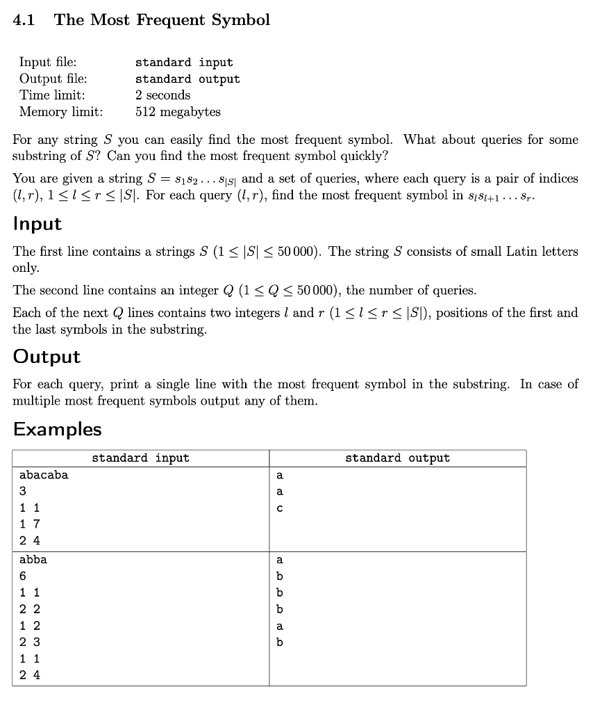
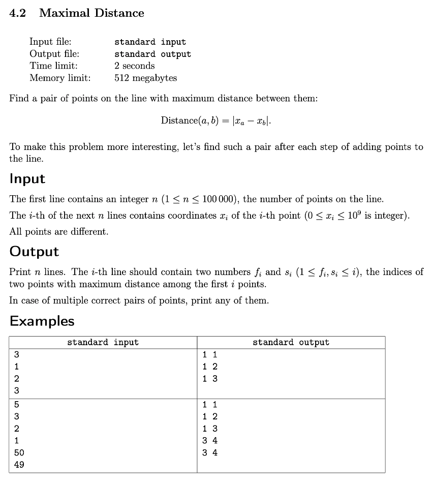
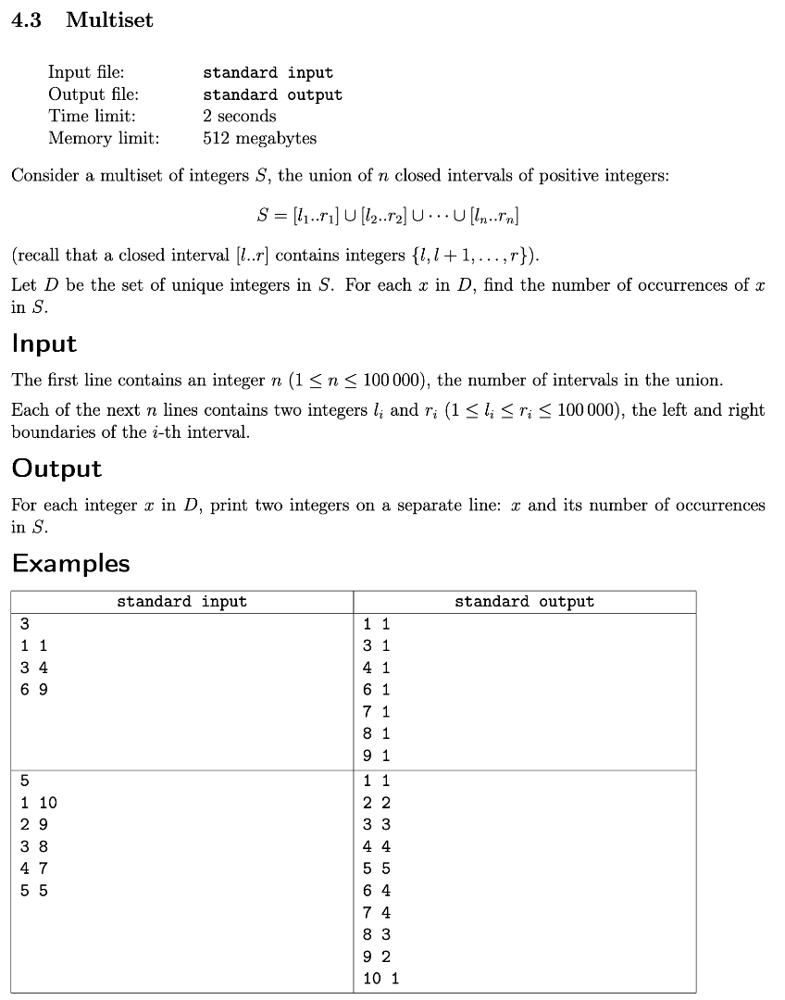
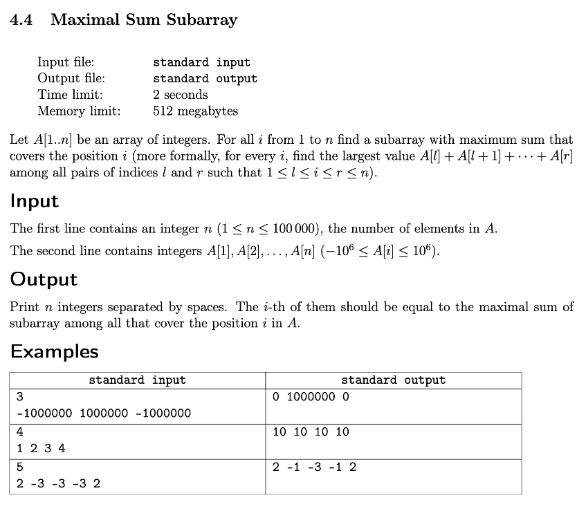

# Week 4: Technical Problems

## Key Concepts
* Invent basic greedy solutions and prove their correctness
* Understand what programming language features are most important on competitions
* Know specialties of popular programming languages
* Apply the segment tree data structure to solve problems which require answer queries of certain form

## Resources
1. [Greedy Algorithms](docs/1_greedy_algorithms/greedy.pdf)
2. [Segment Tree](docs/2_segment_tree/segment_final.pdf)
3. [Language Specifics](docs/3_language_specifics/language.pdf)

## Assignments
1. [The Most Frequent Symbol](#the-most-frequent-symbol)
2. [Maximal Distance](#maximal-distance)
3. [Multiset](#multiset)
4. [Maximal Sum Subarray](#maximal-sum-subarray)

---

## The Most Frequent Symbol



```cpp
#include <iostream>
#include <vector>
#include <unordered_map>

using namespace std;
using PrefixCount = vector<unordered_map<char, int>>;

int main() {
    string S; cin >> S;
    int N = S.size();
    PrefixCount A(N + 1);
    for (auto i{ 1 }; i <= N; ++i)         // i is offset by 1 for recurrence relation...
        A[i] = A[i - 1], ++A[i][S[i - 1]]; // A[i] = A[i - 1] with count of current char at S[i - 1] incremented by 1
    auto getMaxFreq = [&](auto i, auto j) {
        auto max{ 0 };
        auto ans{ 'a' };
        for (auto& pair: A[j]) {
            auto c = pair.first;
            auto cnt = A[j][c] - A[i - 1][c]; // use prefix count for O(1) lookup per range i..j
            if (max < cnt)
                max = cnt,
                ans = c;
        }
        return ans;
    };
    int K; cin >> K;
    while (K--) {
        int L, R; cin >> L >> R;
        cout << getMaxFreq(L, R) << endl;
    }
    return 0;
}
```

---

## Maximal Distance



```cpp
#include <iostream>

using namespace std;

int main() {
    struct MinMax {
        int INF = 1e9 + 7,
            min{  INF },
            max{ -INF };
    } value, index;
    int N; cin >> N;
    for (auto i{ 1 }; i <= N; ++i) {
        int x; cin >> x;
        if (value.min > x) value.min = x, index.min = i;
        if (value.max < x) value.max = x, index.max = i;
        cout << min(index.min, index.max)
             << " "
             << max(index.min, index.max)
             << endl;
    }
    return 0;
}
```

---

## Multiset



```cpp

```

---

## Maximal Sum Subarray



```cpp
#include <iostream>
#include <vector>
#include <algorithm>
#include <iterator>
#include <cassert>

using namespace std;
using LL = long long;
using VLL = vector<LL>;

int main() {
    int N; cin >> N;
    VLL A, ans;
    copy_n(istream_iterator<LL>(cin), N, back_inserter(A));
    VLL L(N + 1), R(N + 1);
    auto prefixSums = [&]() {
        for (auto i{ 1 }    ; i <= N; ++i) L[i] = L[i - 1] + A[i - 1];
        for (auto i{ N - 1 }; i >= 0; --i) R[i] = R[i + 1] + A[i];
    };
    auto prefixMins = [&]() {
        for (auto i{ 1 }    ; i <= N; ++i) L[i] = min(L[i], L[i - 1]);
        for (auto i{ N - 1 }; i >= 0; --i) R[i] = min(R[i], R[i + 1]);
    };
    prefixSums();
    assert(L[N] == R[0]); // total sum exists at the end of each prefix sum
    auto sum = L[N] = R[0];
    prefixMins();
    for (auto i{ 0 }; i < N; ++i)
        ans.push_back(sum - L[i] - R[i + 1]);
    copy(ans.begin(), ans.end(), ostream_iterator<LL>(cout, " ")), cout << endl;
    return 0;
}
```