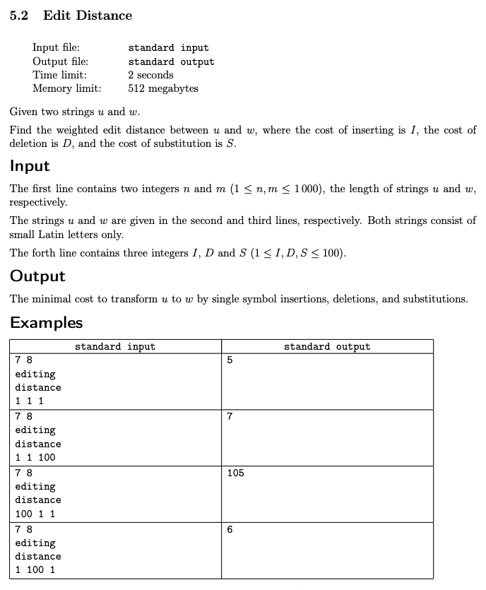
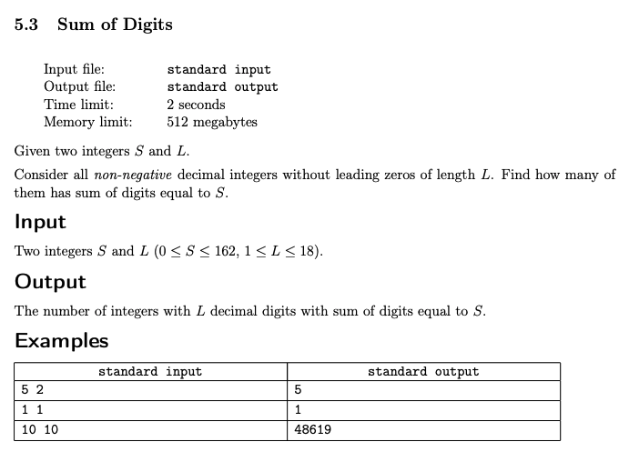

# Week 5: Dynamic Programming
## Key Concepts
* Subproblems (and recurrence relation on them) are the most important ingredient of a dynamic programming algorithm
* Two common ways of arriving at the right subproblem:
	1. Analyze the structure of an optimal solution
	2. Implement a brute-force solution and optimize it

## Resources
1. [Dynamic Programming](docs/dynprog.pdf)

## Assignments
1. [Longest Increasing Subsequence](#longest-increasing-subsequence)
2. [Edit Distance](#edit-distance)
3. [Sum of Digits](#sum-of-digits)

---

## Longest Increasing Subsequence


```cpp
#include <iostream>
#include <vector>
#include <algorithm>
#include <iterator>
#include <unordered_map>

#define TOP_DOWN

using namespace std;
using VI = vector<int>;
using Memo = unordered_map<int, int>; // { end index, max inc seq len }

#ifdef TOP_DOWN
int go(VI& A, Memo& T, int j) {
    if (T.find(j) != T.end())
        return T[j];
    T[j] = 1; // each index j represents a subsequence of length 1
    for (auto i{ 0 }; i < j; ++i)
        if (A[i] < A[j])
            T[j] = max(T[j], 1 + go(A, T, i));
    return T[j];
}
#endif
int main() {
    int N; cin >> N;
    VI A; copy_n(istream_iterator<int>(cin), N, back_inserter(A));
#ifdef TOP_DOWN // 👇
    auto max{ 0 };
    Memo T;
    for (auto j{ 0 }; j < N; ++j) // for each ending position j inclusive
        max = std::max(max, go(A, T, j)); // best T[j] via each LIS ending at each position i < j where A[i] < A[j]
    cout << max << endl;
#else // BOTTOM_UP 👆
    VI T(N, 1);
    for (auto j{ 0 }; j < N; ++j) // for each ending position j inclusive
        for (auto i{ 0 }; i < j; ++i)
            if (A[i] < A[j])
                T[j] = std::max(T[j], 1 + T[i]); // best T[j] via each LIS ending at each position i < j where A[i] < A[j]
    cout << *max_element(T.begin(), T.end()) << endl;
#endif
    return 0;
}
```

---

## Edit Distance



```cpp
#include <iostream>
#include <sstream>
#include <vector>
#include <unordered_map>
#include <algorithm>

//#define TOP_DOWN

using namespace std;
using VI = vector<int>;
using VVI = vector<VI>;
using Memo = unordered_map<string, int>;

int ins, del, sub; // cost of insertions, deletions, and substitutions

#ifdef TOP_DOWN
/*
// TLE without memo
int go(string& A, string& B, int i, int j) {
    if (i == 0) return j * ins;
    if (j == 0) return i * del;
    return min({
        go(A, B, i - 1, j - 1) + (A[i - 1] == B[j - 1] ? 0 : sub),
        go(A, B, i, j - 1) + ins,
        go(A, B, i - 1, j) + del
    });
}
*/
// TLE with memo
int go(string& A, string& B, int i, int j, Memo&& T = {}) {
    stringstream key; key << i << "," << j;
    if (T.find(key.str()) != T.end())
        return T[key.str()];
    if (i == 0) return T[key.str()] = j * ins;
    if (j == 0) return T[key.str()] = i * del;
    return T[key.str()] = min({
        go(A, B, i - 1, j - 1, move(T)) + (A[i - 1] == B[j - 1] ? 0 : sub),
        go(A, B, i, j - 1, move(T)) + ins,
        go(A, B, i - 1, j, move(T)) + del
    });
}
#endif
int main() {
    string _, A, B;
    cin >> _ >> _ >> A >> B;
    cin >> ins >> del >> sub;
#ifdef TOP_DOWN // 👇
    cout << go(A, B, A.size(), B.size()) << endl;
#else // BOTTOM_UP 👆
    int M = A.size(),
        N = B.size();
    VVI T(M + 1, VI(N + 1));
    for (auto i{ 1 }; i <= M; ++i) T[i][0] = i * del;
    for (auto j{ 1 }; j <= N; ++j) T[0][j] = j * ins;
    for (auto i{ 1 }; i <= M; ++i)
        for (auto j{ 1 }; j <= N; ++j)
            T[i][j] = min({
                T[i - 1][j - 1] + (A[i - 1] == B[j - 1] ? 0 : sub),
                T[i][j - 1] + ins,
                T[i - 1][j] + del
            });
    cout << T[M][N] << endl;
#endif
    return 0;
}
```

---

## Sum of Digits



```cpp
#include <iostream>
#include <sstream>
#include <unordered_map>
#include <vector>

using namespace std;
using LL = long long;
using Memo = unordered_map<string, LL>;
using VLL = vector<LL>;
using VVLL = vector<VLL>;

//#define TOP_DOWN

#ifdef TOP_DOWN
/*
// TLE without memo
LL go(int sum, int len) {
    if (len == 0)
        return int(sum == 0); // base case: if the sum is reduced to 0, then there is exactly 1 solution 🎯
    auto cnt{ 0LL };
    for (auto x{ 0 }; x <= 9; ++x)
        if (sum - x >= 0)
            cnt += go(sum - x, len - 1);
    return cnt;
}
*/
LL go(int sum, int len, Memo&& T = {}) {
    stringstream key; key << sum << "," << len;
    if (T.find(key.str()) != T.end())
        return T[key.str()];
    if (len == 0)
        return sum == 0; // base case: if the sum is reduced to 0, then there is exactly 1 solution 🎯
    auto cnt{ 0LL };
    for (auto x{ 0 }; x <= 9; ++x)
        if (sum - x >= 0)
            cnt += go(sum - x, len - 1, move(T));
    return T[key.str()] = cnt;
}
#endif
int main() {
    int sum, len; cin >> sum >> len;
#ifdef TOP_DOWN // 👇
    auto cnt{ 0LL };
    for (auto x = int(len > 1); x <= 9; ++x) // first digit cannot start with 0 unless it is a single digit of length 1
        if (sum - x >= 0)
            cnt += go(sum - x, len - 1);
    cout << cnt << endl;
#else // BOTTOM_UP 👆
    if (sum == 0) {
        cout << int(len == 1) << endl; // special case if sum == 0, then there is only 1 solution (ie. the single digit 0 with length 1)
    } else {
        VVLL T(len + 1, VLL(sum + 1)); // first row and first column are not used
        for (auto i{ 1 }; i <= len; ++i) T[i][0] = 1; // base case: if the sum is reduced to 0, then there is exactly 1 solution 🎯
        for (auto j{ 1 }; j <= min(9, sum); ++j) T[1][j] = 1; // single digits j = 1..9 have exactly 1 solution of length 1 (ie. j itself)
        for (auto i{ 2 }; i <= len; ++i)
            for (auto j{ 1 }; j <= sum; ++j)
                for (auto x = int(i == len); x <= 9; ++x) // limit final digit to 1..9 as if it where the first digit (ie. cannot be 0)
                    if (j - x >= 0)
                        T[i][j] += T[i - 1][j - x];
        cout << T[len][sum] << endl;
    }
#endif
    return 0;
}
```
