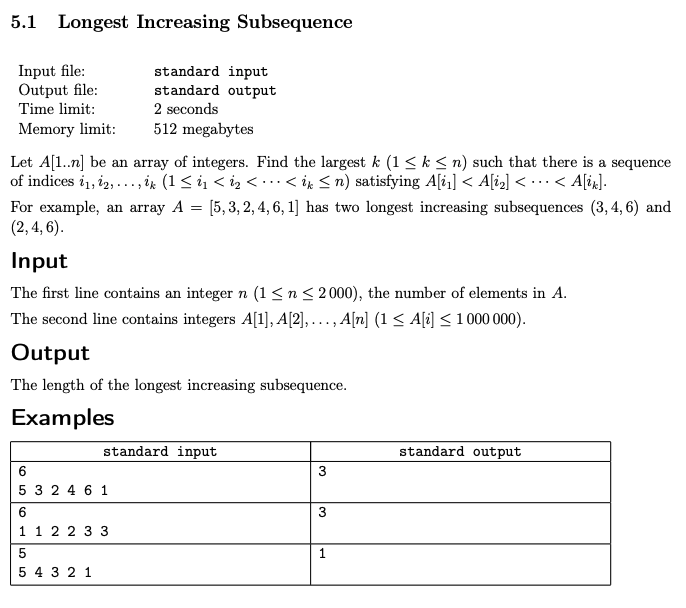

# Week 5: Dynamic Programming
## Key Concepts
* Subproblems (and recurrence relation on them) are the most important ingredient of a dynamic programming algorithm
* Two common ways of arriving at the right subproblem:
	1. Analyze the structure of an optimal solution
	2. Implement a brute-force solution and optimize it

## Resources
1. [Dynamic Programming](docs/dynprog.pdf)

## Assignments
1. [Longest Increasing Subsequence](#longest-increasing-subsequence)

---

## Longest Increasing Subsequence



```cpp
#include <iostream>
#include <vector>
#include <algorithm>
#include <iterator>
#include <unordered_map>

#define TOP_DOWN

using namespace std;
using VI = vector<int>;
using Memo = unordered_map<int, int>; // { end index, max inc seq len }

int go(VI& A, Memo& T, int j) {
    if (T.find(j) != T.end())
        return T[j];
    T[j] = 1; // each index j represents a subsequence of length 1
    for (auto i{ 0 }; i < j; ++i)
        if (A[i] < A[j])
            T[j] = max(T[j], 1 + go(A, T, i));
    return T[j];
}
int main() {
    int N; cin >> N;
    VI A; copy_n(istream_iterator<int>(cin), N, back_inserter(A));
#ifdef TOP_DOWN // 👇
    auto max{ 0 };
    Memo T;
    for (auto j{ 0 }; j < N; ++j) // for each ending position j inclusive
        max = std::max(max, go(A, T, j)); // best T[j] via each LIS ending at each position i < j where A[i] < A[j]
    cout << max << endl;
#else // BOTTOM_UP 👆
    VI T(N, 1);
    for (auto j{ 0 }; j < N; ++j) // for each ending position j inclusive
        for (auto i{ 0 }; i < j; ++i)
            if (A[i] < A[j])
                T[j] = std::max(T[j], 1 + T[i]); // best T[j] via each LIS ending at each position i < j where A[i] < A[j]
    cout << *max_element(T.begin(), T.end()) << endl;
#endif
    return 0;
}
```