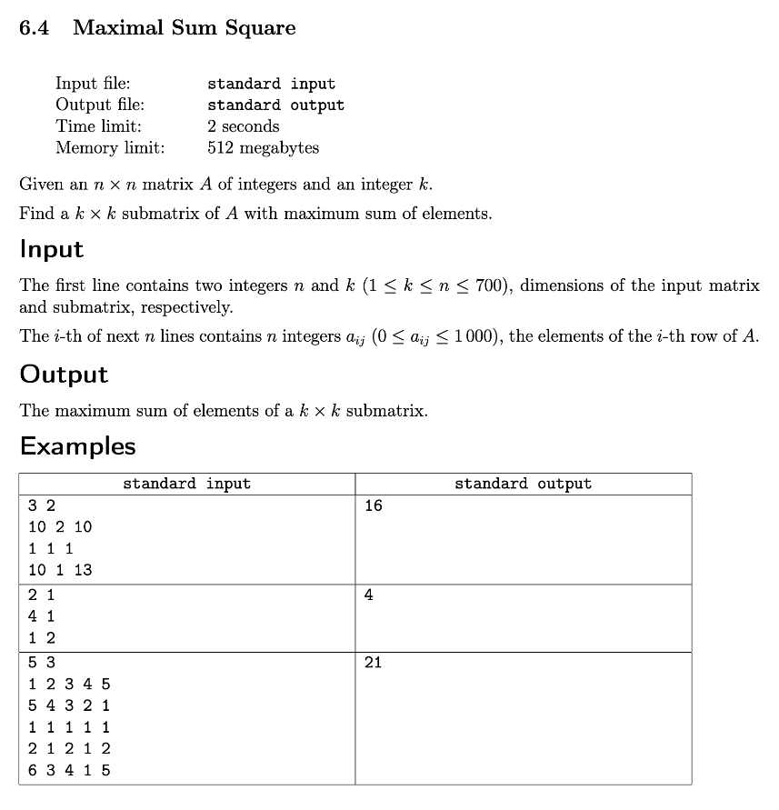

# Week 6: Dynamic Programming 2
## Key Concepts
* Practice implementing dynamic programming solutions
* Design dynamic programming solutions

## Resources
* [Dynamic Programming 2](docs/dynprog2.pdf)

## Assignments
* [1. Knapsack](#knapsack)
* [4. Maximal Sum Square](#maximal-sum-square)

---

## Knapsack


```cpp
#include <iostream>
#include <vector>
#include <set>
#include <algorithm>
#include <iterator>

using namespace std;
using VI = vector<int>;
using VVI = vector<VI>;
using Sack = set<int>;

#define TOP_DOWN

#ifdef TOP_DOWN
int go(VVI& T, VI& W, VI& V, int i, int j) {
    if (T[i][j] > -1)
        return T[i][j];
    if (i == 0)
        return T[i][j] = 0;
    T[i][j] = go(T, W, V, i - 1, j); // without i-th item
    if (j - W[i - 1] >= 0)
        T[i][j] = max(T[i][j], V[i - 1] + go(T, W, V, i - 1, j - W[i - 1])); // max of with/without i-th item
    return T[i][j];
}
#endif
int main() {
    int N, CAP; cin >> N >> CAP;
    VI W(N), V(N);
    for (auto i{ 0 }; i < N; ++i)
        cin >> W[i] >> V[i];
    VVI T(N + 1, VI(CAP + 1));
#ifdef TOP_DOWN // 👇
    for (auto& row: T)
        fill(row.begin(), row.end(), -1);
    go(T, W, V, N, CAP);
#else // BOTTOM_UP 👆
    for (auto i{ 1 }; i <= N; ++i) {
        for (auto j{ 1 }; j <= CAP; ++j) {
            T[i][j] = T[i - 1][j]; // without i-th item
            if (j - W[i - 1] >= 0)
                T[i][j] = max(T[i][j], T[i - 1][j - W[i - 1]] + V[i - 1]); // max of with/without i-th item
        }
    }
#endif
    Sack best;
    for (auto i{ N }, j{ CAP }; i > 0; --i)
        if (T[i][j] != T[i - 1][j])
            best.insert(i),
            j -= W[i - 1];
    cout << best.size() << endl;
    copy(best.begin(), best.end(), ostream_iterator<int>(cout, " ")), cout << endl;
    return 0;
}
```

## Maximal Sum Square



```cpp
#include <iostream>
#include <vector>
#include <algorithm>
#include <iterator>

using namespace std;
using VI = vector<int>;
using VVI = vector<VI>;

int main() {
    int N, K; cin >> N >> K;
    VVI A(N);
    for (auto i{ 0 }; i < N; ++i)
        copy_n(istream_iterator<int>(cin), N, back_inserter(A[i]));
    VVI T(N + 1, VI(N + 1));
    for (auto i{ 1 }; i <= N; ++i)
        for (auto j{ 1 }; j <= N; ++j)
            T[i][j] = A[i - 1][j - 1] // corresponding A[i][j] offset by 1
                    + T[i - 1][j] // top
                    + T[i][j - 1] // left
                    - T[i - 1][j - 1]; // subtract top-left once because it was added twice (once in top and once in left)
    --K; // let K be inclusive for ranges from i..K and j..K to find the max sum (this avoids having to subtract by 1 below)
    auto max{ 0 }, sum{ 0 };
    for (auto i{ 1 }; i + K <= N; ++i)
        for (auto j{ 1 }; j + K <= N; ++j)
            sum = T[i + K][j + K] // bottom-right contains absolute sum from [0, 0] to [i + K, j + K]
                - T[i - 1][j + K] // top  contains absolute sum from [0, 0] to [i - 1, j + K]
                - T[i + K][j - 1] // left contains absolute sum from [0, 0] to [i + K, j - 1]
                + T[i - 1][j - 1], // add top-left once because it was subtracted twice (once in top and once in left)
            max = std::max(max, sum); // max sum 🎯
    cout << max << endl;
    return 0;
}
```